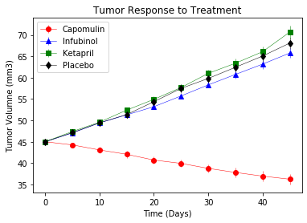
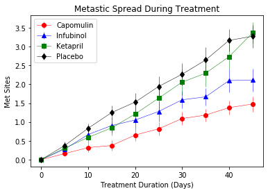
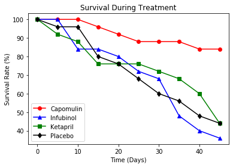

```python
# Dependencies and Setup
%matplotlib inline
import matplotlib.pyplot as plt
import pandas as pd
import numpy as np

# Hide warning messages in notebook
import warnings
warnings.filterwarnings('ignore')

# File to Load (Remember to Change These)
mouse_drug_data_to_load = "data/mouse_drug_data.csv"
clinical_trial_data_to_load = "data/clinicaltrial_data.csv"

# Read the Mouse and Drug Data and the Clinical Trial Data
mouse_drug_data = pd.read_csv(mouse_drug_data_to_load)
clinical_trial_data = pd.read_csv(clinical_trial_data_to_load)


```


```python
# Combine the data into a single dataset
combine_data_df = pd.merge(mouse_drug_data, clinical_trial_data, on="Mouse ID", how="left")

#replace all NAN values with 0
combine_data_df = combine_data_df.fillna(0)

# Display the data table for preview

combine_data_df.head()
```


<div>
<style scoped>
    .dataframe tbody tr th:only-of-type {
        vertical-align: middle;
    }

    .dataframe tbody tr th {
        vertical-align: top;
    }

    .dataframe thead th {
        text-align: right;
    }
</style>
<table border="1" class="dataframe">
  <thead>
    <tr style="text-align: right;">
      <th></th>
      <th>Mouse ID</th>
      <th>Drug</th>
      <th>Timepoint</th>
      <th>Tumor Volume (mm3)</th>
      <th>Metastatic Sites</th>
    </tr>
  </thead>
  <tbody>
    <tr>
      <td>0</td>
      <td>f234</td>
      <td>Stelasyn</td>
      <td>0</td>
      <td>45.000000</td>
      <td>0</td>
    </tr>
    <tr>
      <td>1</td>
      <td>f234</td>
      <td>Stelasyn</td>
      <td>5</td>
      <td>47.313491</td>
      <td>0</td>
    </tr>
    <tr>
      <td>2</td>
      <td>f234</td>
      <td>Stelasyn</td>
      <td>10</td>
      <td>47.904324</td>
      <td>0</td>
    </tr>
    <tr>
      <td>3</td>
      <td>f234</td>
      <td>Stelasyn</td>
      <td>15</td>
      <td>48.735197</td>
      <td>1</td>
    </tr>
    <tr>
      <td>4</td>
      <td>f234</td>
      <td>Stelasyn</td>
      <td>20</td>
      <td>51.112713</td>
      <td>2</td>
    </tr>
  </tbody>
</table>
</div>


## Tumor Response to Treatment


```python
# Create new data frame 
tumor_data_timepoint = combine_data_df[["Drug", "Timepoint","Tumor Volume (mm3)"]]

# Store the Mean Tumor Volume Data Grouped by Drug and Timepoint 
tumor_volume_data = tumor_data_timepoint.groupby(["Drug", "Timepoint"])

# Calculate the mean
tumor_volume_data_mean = tumor_volume_data["Tumor Volume (mm3)"].mean()
#tumor_volume_data_mean.head()

#tumor_volume_data_mean.head(100)


# Convert to DataFrame
tumor_response_treatment_df = pd.DataFrame(tumor_volume_data_mean)
tumor_response_treatment_df
```


<div>
<style scoped>
    .dataframe tbody tr th:only-of-type {
        vertical-align: middle;
    }

    .dataframe tbody tr th {
        vertical-align: top;
    }

    .dataframe thead th {
        text-align: right;
    }
</style>
<table border="1" class="dataframe">
  <thead>
    <tr style="text-align: right;">
      <th></th>
      <th></th>
      <th>Tumor Volume (mm3)</th>
    </tr>
    <tr>
      <th>Drug</th>
      <th>Timepoint</th>
      <th></th>
    </tr>
  </thead>
  <tbody>
    <tr>
      <td rowspan="5" valign="top">Capomulin</td>
      <td>0</td>
      <td>45.000000</td>
    </tr>
    <tr>
      <td>5</td>
      <td>44.266086</td>
    </tr>
    <tr>
      <td>10</td>
      <td>43.084291</td>
    </tr>
    <tr>
      <td>15</td>
      <td>42.064317</td>
    </tr>
    <tr>
      <td>20</td>
      <td>40.716325</td>
    </tr>
    <tr>
      <td>...</td>
      <td>...</td>
      <td>...</td>
    </tr>
    <tr>
      <td rowspan="5" valign="top">Zoniferol</td>
      <td>25</td>
      <td>55.432935</td>
    </tr>
    <tr>
      <td>30</td>
      <td>57.713531</td>
    </tr>
    <tr>
      <td>35</td>
      <td>60.089372</td>
    </tr>
    <tr>
      <td>40</td>
      <td>62.916692</td>
    </tr>
    <tr>
      <td>45</td>
      <td>65.960888</td>
    </tr>
  </tbody>
</table>
<p>100 rows × 1 columns</p>
</div>


```python
# Store the Standard Error of Tumor Volumes Grouped by Drug and Timepoint

tumor_volume_data_sd = tumor_volume_data["Tumor Volume (mm3)"].sem()

# Convert to DataFrame

tumor_volume_data_sd_df = pd.DataFrame(tumor_volume_data_sd)

# Pivot and Preview DataFrame

tumor_volume_data_sd_df = tumor_volume_data_sd_df.reset_index()

tumor_volume_data_sd_df = tumor_volume_data_sd_df.pivot(index="Timepoint",columns="Drug",values="Tumor Volume (mm3)")

tumor_volume_data_sd_df.head()


```


<div>
<style scoped>
    .dataframe tbody tr th:only-of-type {
        vertical-align: middle;
    }

    .dataframe tbody tr th {
        vertical-align: top;
    }

    .dataframe thead th {
        text-align: right;
    }
</style>
<table border="1" class="dataframe">
  <thead>
    <tr style="text-align: right;">
      <th>Drug</th>
      <th>Capomulin</th>
      <th>Ceftamin</th>
      <th>Infubinol</th>
      <th>Ketapril</th>
      <th>Naftisol</th>
      <th>Placebo</th>
      <th>Propriva</th>
      <th>Ramicane</th>
      <th>Stelasyn</th>
      <th>Zoniferol</th>
    </tr>
    <tr>
      <th>Timepoint</th>
      <th></th>
      <th></th>
      <th></th>
      <th></th>
      <th></th>
      <th></th>
      <th></th>
      <th></th>
      <th></th>
      <th></th>
    </tr>
  </thead>
  <tbody>
    <tr>
      <td>0</td>
      <td>0.000000</td>
      <td>0.000000</td>
      <td>0.000000</td>
      <td>0.000000</td>
      <td>0.000000</td>
      <td>0.000000</td>
      <td>0.000000</td>
      <td>0.000000</td>
      <td>0.000000</td>
      <td>0.000000</td>
    </tr>
    <tr>
      <td>5</td>
      <td>0.448593</td>
      <td>0.164505</td>
      <td>0.235102</td>
      <td>0.264819</td>
      <td>0.202385</td>
      <td>0.218091</td>
      <td>0.231708</td>
      <td>0.482955</td>
      <td>0.239862</td>
      <td>0.188950</td>
    </tr>
    <tr>
      <td>10</td>
      <td>0.702684</td>
      <td>0.236144</td>
      <td>0.282346</td>
      <td>0.357421</td>
      <td>0.319415</td>
      <td>0.402064</td>
      <td>0.376195</td>
      <td>0.720225</td>
      <td>0.433678</td>
      <td>0.263949</td>
    </tr>
    <tr>
      <td>15</td>
      <td>0.838617</td>
      <td>0.332053</td>
      <td>0.357705</td>
      <td>0.580268</td>
      <td>0.444378</td>
      <td>0.614461</td>
      <td>0.466109</td>
      <td>0.770432</td>
      <td>0.493261</td>
      <td>0.370544</td>
    </tr>
    <tr>
      <td>20</td>
      <td>0.909731</td>
      <td>0.359482</td>
      <td>0.476210</td>
      <td>0.726484</td>
      <td>0.595260</td>
      <td>0.839609</td>
      <td>0.555181</td>
      <td>0.786199</td>
      <td>0.621889</td>
      <td>0.533182</td>
    </tr>
  </tbody>
</table>
</div>


```python
# Minor Data Munging to Re-Format the Data Frames
#tumor_response_treatment_sum_df = tumor_response_treatment_df.set_index("Timepoint")

tumor_response_treatment_sum_df = tumor_response_treatment_df.reset_index()

#tumor_response_treatment_sum_df.head()
# Preview that Reformatting worked

#tumor_response_treatment_sum_df = tumor_response_treatment_sum_df.pivot(columns="Drug", values="Tumor Volume (mm3)")
#tumor_response_treatment_sum_df.head()

tumor_response_treatment_sum_df = tumor_response_treatment_sum_df.pivot(index="Timepoint",columns="Drug",values="Tumor Volume (mm3)")
tumor_response_treatment_sum_df.head()
```


<div>
<style scoped>
    .dataframe tbody tr th:only-of-type {
        vertical-align: middle;
    }

    .dataframe tbody tr th {
        vertical-align: top;
    }

    .dataframe thead th {
        text-align: right;
    }
</style>
<table border="1" class="dataframe">
  <thead>
    <tr style="text-align: right;">
      <th>Drug</th>
      <th>Capomulin</th>
      <th>Ceftamin</th>
      <th>Infubinol</th>
      <th>Ketapril</th>
      <th>Naftisol</th>
      <th>Placebo</th>
      <th>Propriva</th>
      <th>Ramicane</th>
      <th>Stelasyn</th>
      <th>Zoniferol</th>
    </tr>
    <tr>
      <th>Timepoint</th>
      <th></th>
      <th></th>
      <th></th>
      <th></th>
      <th></th>
      <th></th>
      <th></th>
      <th></th>
      <th></th>
      <th></th>
    </tr>
  </thead>
  <tbody>
    <tr>
      <td>0</td>
      <td>45.000000</td>
      <td>45.000000</td>
      <td>45.000000</td>
      <td>45.000000</td>
      <td>45.000000</td>
      <td>45.000000</td>
      <td>45.000000</td>
      <td>45.000000</td>
      <td>45.000000</td>
      <td>45.000000</td>
    </tr>
    <tr>
      <td>5</td>
      <td>44.266086</td>
      <td>46.503051</td>
      <td>47.062001</td>
      <td>47.389175</td>
      <td>46.796098</td>
      <td>47.125589</td>
      <td>47.248967</td>
      <td>43.944859</td>
      <td>47.527452</td>
      <td>46.851818</td>
    </tr>
    <tr>
      <td>10</td>
      <td>43.084291</td>
      <td>48.285125</td>
      <td>49.403909</td>
      <td>49.582269</td>
      <td>48.694210</td>
      <td>49.423329</td>
      <td>49.101541</td>
      <td>42.531957</td>
      <td>49.463844</td>
      <td>48.689881</td>
    </tr>
    <tr>
      <td>15</td>
      <td>42.064317</td>
      <td>50.094055</td>
      <td>51.296397</td>
      <td>52.399974</td>
      <td>50.933018</td>
      <td>51.359742</td>
      <td>51.067318</td>
      <td>41.495061</td>
      <td>51.529409</td>
      <td>50.779059</td>
    </tr>
    <tr>
      <td>20</td>
      <td>40.716325</td>
      <td>52.157049</td>
      <td>53.197691</td>
      <td>54.920935</td>
      <td>53.644087</td>
      <td>54.364417</td>
      <td>53.346737</td>
      <td>40.238325</td>
      <td>54.067395</td>
      <td>53.170334</td>
    </tr>
  </tbody>
</table>
</div>


```python
# Generate the Plot (with Error Bars)

plt.errorbar(tumor_response_treatment_sum_df.index,tumor_response_treatment_sum_df["Capomulin"],yerr=tumor_volume_data_sd_df["Capomulin"],color="red", marker= "o", label="Capomulin", linewidth=0.5)
plt.errorbar(tumor_response_treatment_sum_df.index,tumor_response_treatment_sum_df["Infubinol"],yerr=tumor_volume_data_sd_df["Infubinol"],color="blue", marker= "^", label="Infubinol", linewidth=0.5)
plt.errorbar(tumor_response_treatment_sum_df.index,tumor_response_treatment_sum_df["Ketapril"],yerr=tumor_volume_data_sd_df["Ketapril"],color="green", marker= "s", label="Ketapril", linewidth=0.5)
plt.errorbar(tumor_response_treatment_sum_df.index,tumor_response_treatment_sum_df["Placebo"],yerr=tumor_volume_data_sd_df["Placebo"],color="black", marker= "d", label="Placebo", linewidth=0.5)

plt.legend()
plt.title("Tumor Response to Treatment")
plt.xlabel("Time (Days)")
plt.ylabel("Tumor Volumne (mm3)")

# Show the Figure
plt.show()
```





## Metastatic Response to Treatment


```python
# Create new data frame 
met_data_timepoint = combine_data_df[["Drug", "Timepoint","Metastatic Sites"]]

# Store the Mean Met. Site Data Grouped by Drug and Timepoint 
met_volume_data = met_data_timepoint.groupby(["Drug", "Timepoint"])

# Calculate the mean
met_volume_data_mean = met_volume_data["Metastatic Sites"].mean()
#tumor_volume_data_mean.head()

# Convert to DataFrame
met_response_treatment_df = pd.DataFrame(met_volume_data_mean)
#met_response_treatment_df.head()

```


<div>
<style scoped>
    .dataframe tbody tr th:only-of-type {
        vertical-align: middle;
    }

    .dataframe tbody tr th {
        vertical-align: top;
    }

    .dataframe thead th {
        text-align: right;
    }
</style>
<table border="1" class="dataframe">
  <thead>
    <tr style="text-align: right;">
      <th></th>
      <th></th>
      <th>Metastatic Sites</th>
    </tr>
    <tr>
      <th>Drug</th>
      <th>Timepoint</th>
      <th></th>
    </tr>
  </thead>
  <tbody>
    <tr>
      <td rowspan="5" valign="top">Capomulin</td>
      <td>0</td>
      <td>0.000000</td>
    </tr>
    <tr>
      <td>5</td>
      <td>0.160000</td>
    </tr>
    <tr>
      <td>10</td>
      <td>0.320000</td>
    </tr>
    <tr>
      <td>15</td>
      <td>0.375000</td>
    </tr>
    <tr>
      <td>20</td>
      <td>0.652174</td>
    </tr>
  </tbody>
</table>
</div>


```python
# Store the Standard Error associated with Met. Sites Grouped by Drug and Timepoint 

met_volume_data_sd = met_volume_data["Metastatic Sites"].sem()

# Convert to DataFrame

met_volume_data_sd_df = pd.DataFrame(met_volume_data_sd)

# Preview DataFrame
met_volume_data_sd_df.head()

#Pivot DataFrame
met_volume_data_sd_df = met_volume_data_sd_df.reset_index()

met_volume_data_sd_df = met_volume_data_sd_df.pivot(index="Timepoint",columns="Drug",values="Metastatic Sites")

met_volume_data_sd_df.head()
```


<div>
<style scoped>
    .dataframe tbody tr th:only-of-type {
        vertical-align: middle;
    }

    .dataframe tbody tr th {
        vertical-align: top;
    }

    .dataframe thead th {
        text-align: right;
    }
</style>
<table border="1" class="dataframe">
  <thead>
    <tr style="text-align: right;">
      <th>Drug</th>
      <th>Capomulin</th>
      <th>Ceftamin</th>
      <th>Infubinol</th>
      <th>Ketapril</th>
      <th>Naftisol</th>
      <th>Placebo</th>
      <th>Propriva</th>
      <th>Ramicane</th>
      <th>Stelasyn</th>
      <th>Zoniferol</th>
    </tr>
    <tr>
      <th>Timepoint</th>
      <th></th>
      <th></th>
      <th></th>
      <th></th>
      <th></th>
      <th></th>
      <th></th>
      <th></th>
      <th></th>
      <th></th>
    </tr>
  </thead>
  <tbody>
    <tr>
      <td>0</td>
      <td>0.000000</td>
      <td>0.000000</td>
      <td>0.000000</td>
      <td>0.000000</td>
      <td>0.000000</td>
      <td>0.000000</td>
      <td>0.000000</td>
      <td>0.000000</td>
      <td>0.000000</td>
      <td>0.000000</td>
    </tr>
    <tr>
      <td>5</td>
      <td>0.074833</td>
      <td>0.108588</td>
      <td>0.091652</td>
      <td>0.098100</td>
      <td>0.093618</td>
      <td>0.100947</td>
      <td>0.095219</td>
      <td>0.066332</td>
      <td>0.087178</td>
      <td>0.077709</td>
    </tr>
    <tr>
      <td>10</td>
      <td>0.125433</td>
      <td>0.152177</td>
      <td>0.159364</td>
      <td>0.142018</td>
      <td>0.163577</td>
      <td>0.115261</td>
      <td>0.105690</td>
      <td>0.090289</td>
      <td>0.123672</td>
      <td>0.109109</td>
    </tr>
    <tr>
      <td>15</td>
      <td>0.132048</td>
      <td>0.180625</td>
      <td>0.194015</td>
      <td>0.191381</td>
      <td>0.158651</td>
      <td>0.190221</td>
      <td>0.136377</td>
      <td>0.115261</td>
      <td>0.153439</td>
      <td>0.111677</td>
    </tr>
    <tr>
      <td>20</td>
      <td>0.161621</td>
      <td>0.241034</td>
      <td>0.234801</td>
      <td>0.236680</td>
      <td>0.181731</td>
      <td>0.234064</td>
      <td>0.171499</td>
      <td>0.119430</td>
      <td>0.200905</td>
      <td>0.166378</td>
    </tr>
  </tbody>
</table>
</div>


```python
# Minor Data Munging to Re-Format the Data Frames

met_response_treatment_sum_df = met_response_treatment_df.reset_index()

#met_response_treatment_sum_df.head()

# Preview that Reformatting worked


met_response_treatment_sum_df = met_response_treatment_sum_df.pivot(index="Timepoint",columns="Drug",values="Metastatic Sites")

met_response_treatment_sum_df.head()

```


<div>
<style scoped>
    .dataframe tbody tr th:only-of-type {
        vertical-align: middle;
    }

    .dataframe tbody tr th {
        vertical-align: top;
    }

    .dataframe thead th {
        text-align: right;
    }
</style>
<table border="1" class="dataframe">
  <thead>
    <tr style="text-align: right;">
      <th>Drug</th>
      <th>Capomulin</th>
      <th>Ceftamin</th>
      <th>Infubinol</th>
      <th>Ketapril</th>
      <th>Naftisol</th>
      <th>Placebo</th>
      <th>Propriva</th>
      <th>Ramicane</th>
      <th>Stelasyn</th>
      <th>Zoniferol</th>
    </tr>
    <tr>
      <th>Timepoint</th>
      <th></th>
      <th></th>
      <th></th>
      <th></th>
      <th></th>
      <th></th>
      <th></th>
      <th></th>
      <th></th>
      <th></th>
    </tr>
  </thead>
  <tbody>
    <tr>
      <td>0</td>
      <td>0.000000</td>
      <td>0.000000</td>
      <td>0.000000</td>
      <td>0.000000</td>
      <td>0.000000</td>
      <td>0.000000</td>
      <td>0.000000</td>
      <td>0.000000</td>
      <td>0.000000</td>
      <td>0.000000</td>
    </tr>
    <tr>
      <td>5</td>
      <td>0.160000</td>
      <td>0.380952</td>
      <td>0.280000</td>
      <td>0.304348</td>
      <td>0.260870</td>
      <td>0.375000</td>
      <td>0.320000</td>
      <td>0.120000</td>
      <td>0.240000</td>
      <td>0.166667</td>
    </tr>
    <tr>
      <td>10</td>
      <td>0.320000</td>
      <td>0.600000</td>
      <td>0.666667</td>
      <td>0.590909</td>
      <td>0.523810</td>
      <td>0.833333</td>
      <td>0.565217</td>
      <td>0.250000</td>
      <td>0.478261</td>
      <td>0.500000</td>
    </tr>
    <tr>
      <td>15</td>
      <td>0.375000</td>
      <td>0.789474</td>
      <td>0.904762</td>
      <td>0.842105</td>
      <td>0.857143</td>
      <td>1.250000</td>
      <td>0.764706</td>
      <td>0.333333</td>
      <td>0.782609</td>
      <td>0.809524</td>
    </tr>
    <tr>
      <td>20</td>
      <td>0.652174</td>
      <td>1.111111</td>
      <td>1.050000</td>
      <td>1.210526</td>
      <td>1.150000</td>
      <td>1.526316</td>
      <td>1.000000</td>
      <td>0.347826</td>
      <td>0.952381</td>
      <td>1.294118</td>
    </tr>
  </tbody>
</table>
</div>


```python
# Generate the Plot (with Error Bars)
plt.errorbar(met_response_treatment_sum_df.index,met_response_treatment_sum_df["Capomulin"],yerr=met_volume_data_sd_df["Capomulin"],color="red", marker= "o", label="Capomulin", linewidth=0.5)
plt.errorbar(met_response_treatment_sum_df.index,met_response_treatment_sum_df["Infubinol"],yerr=met_volume_data_sd_df["Infubinol"],color="blue", marker= "^", label="Infubinol", linewidth=0.5)
plt.errorbar(met_response_treatment_sum_df.index,met_response_treatment_sum_df["Ketapril"],yerr=met_volume_data_sd_df["Ketapril"],color="green", marker= "s", label="Ketapril", linewidth=0.5)
plt.errorbar(met_response_treatment_sum_df.index,met_response_treatment_sum_df["Placebo"],yerr=met_volume_data_sd_df["Placebo"],color="black", marker= "d", label="Placebo", linewidth=0.5)

# Save the Figure
plt.legend()
plt.title("Metastic Spread During Treatment")
plt.xlabel("Treatment Duration (Days)")
plt.ylabel("Met Sites")

plt.show()
# Show the Figure

```





## Survival Rates


```python
# Create new data frame 
mouse_data_timepoint = combine_data_df[["Drug", "Timepoint","Mouse ID"]]

# Store the Count of Mice Grouped by Drug and Timepoint (W can pass any metric) 
mouse_data = mouse_data_timepoint.groupby(["Drug", "Timepoint"])

mouse_data_count = mouse_data["Mouse ID"].count()
# Convert to DataFrame

mouse_survival_df = pd.DataFrame(mouse_data_count)
#mouse_survival_df.head()

mouse_survival_df = mouse_survival_df.rename(columns={"Mouse ID":"Mouse Count"})

mouse_survival_df.head()

# Preview DataFrame

```


<div>
<style scoped>
    .dataframe tbody tr th:only-of-type {
        vertical-align: middle;
    }

    .dataframe tbody tr th {
        vertical-align: top;
    }

    .dataframe thead th {
        text-align: right;
    }
</style>
<table border="1" class="dataframe">
  <thead>
    <tr style="text-align: right;">
      <th></th>
      <th></th>
      <th>Mouse Count</th>
    </tr>
    <tr>
      <th>Drug</th>
      <th>Timepoint</th>
      <th></th>
    </tr>
  </thead>
  <tbody>
    <tr>
      <td rowspan="5" valign="top">Capomulin</td>
      <td>0</td>
      <td>25</td>
    </tr>
    <tr>
      <td>5</td>
      <td>25</td>
    </tr>
    <tr>
      <td>10</td>
      <td>25</td>
    </tr>
    <tr>
      <td>15</td>
      <td>24</td>
    </tr>
    <tr>
      <td>20</td>
      <td>23</td>
    </tr>
  </tbody>
</table>
</div>


```python

```


```python
# Minor Data Munging to Re-Format the Data Frames

mouse_survival_sum_df = mouse_survival_df.reset_index()

# Preview the Data Frame


mouse_survival_sum_df = mouse_survival_sum_df.pivot(index="Timepoint",columns="Drug",values="Mouse Count")

mouse_survival_sum_df.head()
```


<div>
<style scoped>
    .dataframe tbody tr th:only-of-type {
        vertical-align: middle;
    }

    .dataframe tbody tr th {
        vertical-align: top;
    }

    .dataframe thead th {
        text-align: right;
    }
</style>
<table border="1" class="dataframe">
  <thead>
    <tr style="text-align: right;">
      <th>Drug</th>
      <th>Capomulin</th>
      <th>Ceftamin</th>
      <th>Infubinol</th>
      <th>Ketapril</th>
      <th>Naftisol</th>
      <th>Placebo</th>
      <th>Propriva</th>
      <th>Ramicane</th>
      <th>Stelasyn</th>
      <th>Zoniferol</th>
    </tr>
    <tr>
      <th>Timepoint</th>
      <th></th>
      <th></th>
      <th></th>
      <th></th>
      <th></th>
      <th></th>
      <th></th>
      <th></th>
      <th></th>
      <th></th>
    </tr>
  </thead>
  <tbody>
    <tr>
      <td>0</td>
      <td>25</td>
      <td>25</td>
      <td>25</td>
      <td>25</td>
      <td>25</td>
      <td>25</td>
      <td>26</td>
      <td>25</td>
      <td>26</td>
      <td>25</td>
    </tr>
    <tr>
      <td>5</td>
      <td>25</td>
      <td>21</td>
      <td>25</td>
      <td>23</td>
      <td>23</td>
      <td>24</td>
      <td>25</td>
      <td>25</td>
      <td>25</td>
      <td>24</td>
    </tr>
    <tr>
      <td>10</td>
      <td>25</td>
      <td>20</td>
      <td>21</td>
      <td>22</td>
      <td>21</td>
      <td>24</td>
      <td>23</td>
      <td>24</td>
      <td>23</td>
      <td>22</td>
    </tr>
    <tr>
      <td>15</td>
      <td>24</td>
      <td>19</td>
      <td>21</td>
      <td>19</td>
      <td>21</td>
      <td>20</td>
      <td>17</td>
      <td>24</td>
      <td>23</td>
      <td>21</td>
    </tr>
    <tr>
      <td>20</td>
      <td>23</td>
      <td>18</td>
      <td>20</td>
      <td>19</td>
      <td>20</td>
      <td>19</td>
      <td>17</td>
      <td>23</td>
      <td>21</td>
      <td>17</td>
    </tr>
  </tbody>
</table>
</div>


```python
# Generate the Plot (Accounting for percentages)

plt.plot(mouse_survival_sum_df["Capomulin"]/25*100,color="red", marker= "o", label="Capomulin")
plt.plot(mouse_survival_sum_df["Infubinol"]/25*100,color="blue", marker= "^", label="Infubinol")
plt.plot(mouse_survival_sum_df["Ketapril"]/25*100,color="green", marker= "s", label="Ketapril")
plt.plot(mouse_survival_sum_df["Placebo"]/25*100,color="black", marker= "d", label="Placebo")

# Save the Figure
plt.legend()
plt.title("Survival During Treatment")
plt.xlabel("Time (Days)")
plt.ylabel("Survival Rate (%)")

# Show the Figure
plt.show()
```





## Summary Bar Graph


```python
# Calculate the percent changes for each drug

# Display the data to confirm

```


```python

```


```python
# Store all Relevant Percent Changes into a Tuple


# Splice the data between passing and failing drugs


# Orient widths. Add labels, tick marks, etc. 


# Use functions to label the percentages of changes


# Call functions to implement the function calls


# Save the Figure


# Show the Figure
fig.show()
```


    ---------------------------------------------------------------------------

    NameError                                 Traceback (most recent call last)

    <ipython-input-16-eb553307bee3> in <module>
         18 
         19 # Show the Figure
    ---> 20 fig.show()
    

    NameError: name 'fig' is not defined


```python

```
